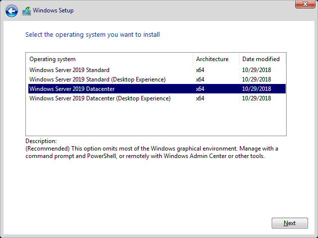
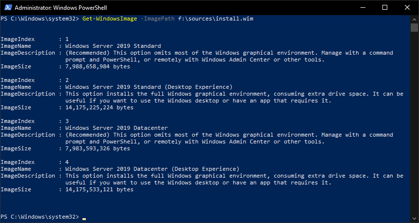
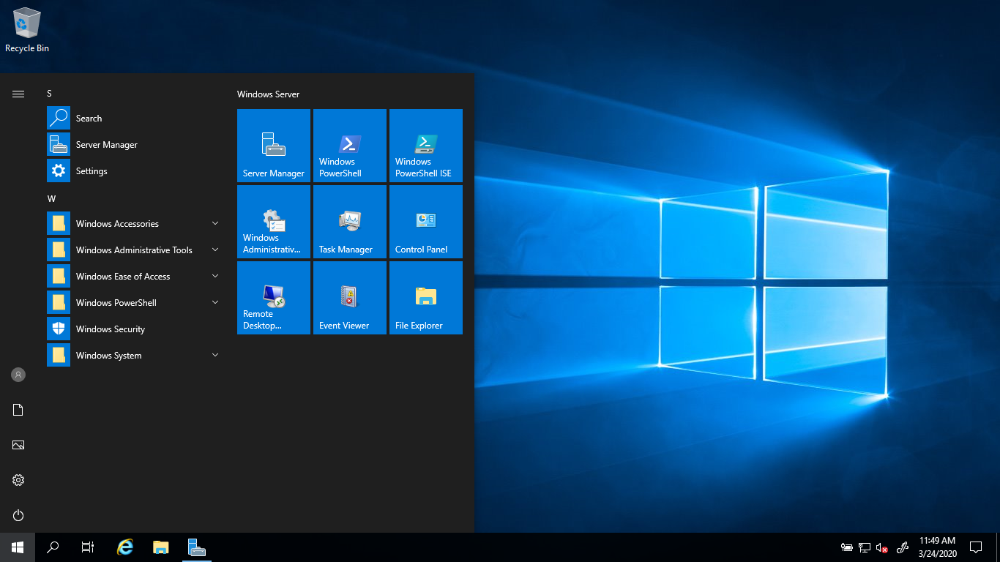
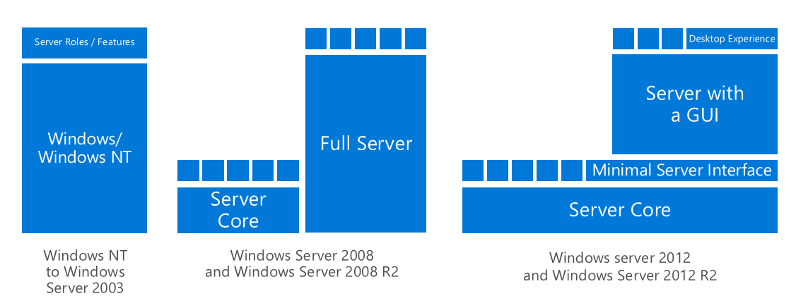
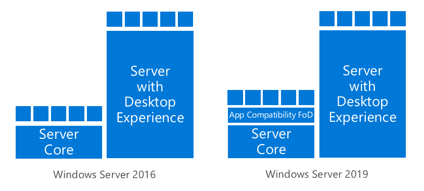
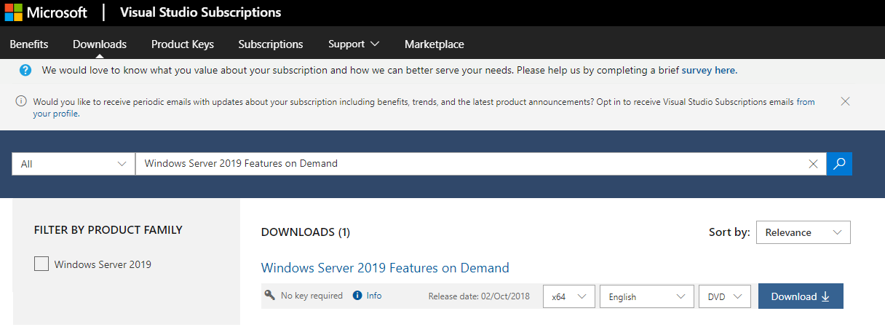
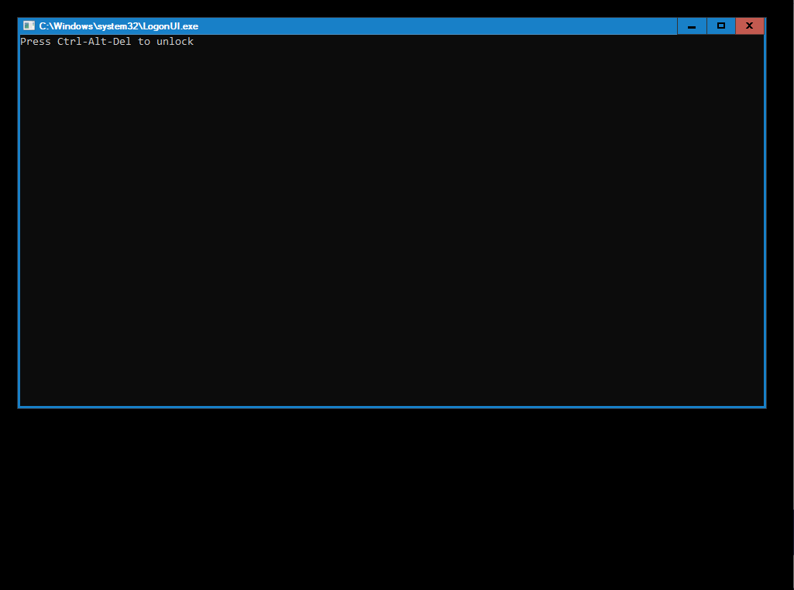
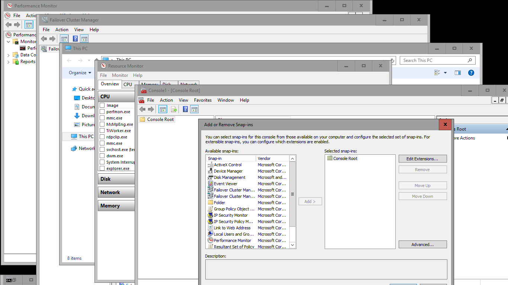

<!-- TOC -->

- [Planning Operating System](#planning-operating-system)
    - [Azure Stack HCI](#azure-stack-hci)
    - [Windows Server](#windows-server)
        - [Installation options](#installation-options)
        - [Server Core History](#server-core-history)
    - [Server Core Improvements in Windows Server 2019](#server-core-improvements-in-windows-server-2019)
        - [Servicing Channels](#servicing-channels)
    - [Releases](#releases)

<!-- /TOC -->

# Planning Operating System

Storage Spaces Direct is technology, that is contained in both Azure Stack HCI OS and Windows Server Datacenter. It enables you to create hyperconverged cluster. Both Operating Systems are easy to use for Windows Server admins as both can (should) be domain joined and managed with traditional tools (such as Server Manager, MMC and new Windows Admin Center).

## Azure Stack HCI

Azure Stack HCI evolved for certification programme to a brand new Operating System. Azure Stack HCI will be updated and improved every year (compared to Windows Server LTSC, that releases every 2-3 years).

### Licensing

With Azure Stack HCI you are also licensed per physical processor core. The difference with Windows Server licensing is that there is no concept of core-packs, you pay for the amount of physical processor cores in your cluster.

With this model the licensing costs switches from a CAPEX to an OPEX model.

Because the billing is managed through Microsoft Azure we can leverage the tools available to get more insights on costs. For example, with Azure Cost Analyses we can query the information and provide forecasts. In addition, the Azure APIs can be used with third party tooling for cost management.

## Windows Server

### Licensing


### Installation options

Before installing operating system, you need to decide which installation option you prefer as Windows Server installation image contains two options. Windows Server with Desktop and Windows Server Core.

For many customers the choice was obvious - using Desktop. But lately we see increased demand in Windows Server Core installations. And there are obvious reasons.

**Windows Server Core helps maintaining best practices**

- Administrators are more effective as they quickly learn to use remote tools such as Windows Admin Center or PowerShell
- Managing servers remotely is way more secure as there is significantly lower chance to expose administrator credentials
- If Administrators are using PowerShell to maintain infrastructure, documentation is way easier and changes are very easy to track using PowerShell transcription and logging
- Installation is clean without any unnecessary components

**Installation options in Setup during manual install process**



**Installation options in install.wim**



**Local user interface**




### Server Core History

First Core installation option was introduced in Windows Server 2008. Back then PowerShell was just released and PowerShell remoting was not even enabled by default. This is one of the reason why Windows Server Core was not received well. In Windows Server 2012 you could even change to core and back after you installed Windows and PowerShell remoting was enabled by default.

**Windows Server install options**



In Windows Server 2016 was this ability removed and Windows Server with GUI received all features in that were before in Desktop Experience as since 2016 we recommend Desktop only where needed (Such as Remote Desktop Session Host). In Windows Server 2019 was new optional App Compatibility Feature on Demand added to help with emergency local management.

**Windows Server install options**



## Server Core Improvements in Windows Server 2019

For emergency purposes, you can add following compatibility functionality available as Feature on Demand.

- Performance Monitor (PerfMon.exe)
- Resource Monitor (Resmon.exe)
- Device Manager (Devmgmt.msc)
- Microsoft Management Console (mmc.exe)
- Windows PowerShell ISE (Powershell_ISE.exe)
- Windows Explorer (Explorer.exe)
- Failover Cluster Manager (Cluadmin.exe)

Features can be added into running system or into installation media using DISM. Features on demand can be added from internet or offline from media or path.

Following PowerShell command adds ServerCore.AppCompatibility feature to running system (requires reboot)

```powershell
Add-WindowsCapability -Online -Name ServerCore.AppCompatibility~~~~0.0.1.0
```

**Downloadable Features on Demand from Visual Studio Subscriptions**



**Slightly different login screen after AppCompatibility features installed**



**Available tools**



### Servicing Channels

In Windows Server 2016 were introduced 2 release channels. Long Term Servicing Branch (LTSB) and Semi-Annual Channel. Later, there was a change in naming, so currently there are two release channels for Windows Server.

- The Semi-Annual Channel (SAC)

- The Long Term Servicing Channel (LTSC)

Semi-Annual Channel is targeted Containers. Long Term Servicing channel is targeted at traditional server roles such as Active Directory or Azure Stack HCI.

For more information visit [Comparison of servicing channels](https://docs.microsoft.com/en-us/windows-server/get-started-19/servicing-channels-19) docs.

## Releases

Storage Spaces Direct (technology that powers Azure Stack HCI) was introduced in Windows Server 2016 and it is exclusive to Datacenter SKU and new Azure Stack HCI Operating system.

It is recommended to use latest release - Azure Stack HCI as it introduced new features that improve diagnosability, performance and scalability.

**More information:**

- [Standard | Datacenter Editions comparison](https://docs.microsoft.com/en-us/windows-server/get-started-19/editions-comparison-19)

- [Windows Server Release information](https://docs.microsoft.com/en-us/windows-server/get-started/windows-server-release-info)

- [Azure Stack HCI on SplitBrain Blog](https://www.splitbrain.com/azure-stack-hci-details/)

- [Azure Stack HCI official documentation](https://docs.microsoft.com/en-us/azure-stack/hci/)