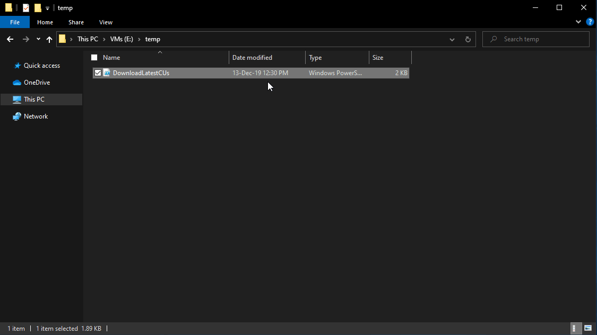
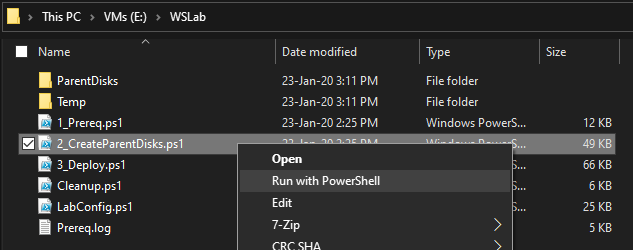
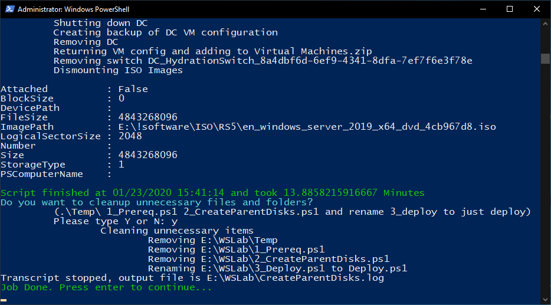
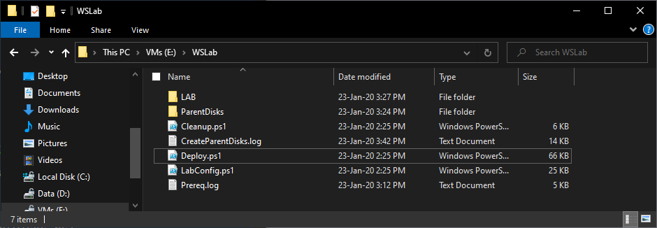

# MSLab Hydration

Process of hydration will prepare all necessary Virtual Hard Disks and will create Domain Controller, so deployment process will take only few minutes.

## Required Files

* [MSLab Scripts](https://aka.ms/mslabzip)
* [Windows Server 2019](https://www.microsoft.com/en-us/evalcenter/evaluate-windows-server-2019)
* Latest Cumulative Update + Servicing Stack Update

Tip: You can download CU and UR using DownloadLatestCU script that will be created after running 1_Prereqs.ps1

## 1_Prereq.ps1

After you will download MSLab Scripts, unzip it into some folder and then just run scripts with PowerShell by Right-Click and selecting Run With PowerShell.

The script will run and will ask for elevation. It will download necessary files (DSC Modules), some example files that will be placed into ToolsDisk folder and some scripts that will be added to ParentDisks folder. ToolsDisk folder can be populated by any tools you might want to have in Tools disk, that can be attached to any VM during deployment phase.

## 2_CreateParentDisks.ps1

Running 2_CreateParentDisk.ps1 will ask for Server ISO image. You can use Evaluation media, or if you have access to VL or Visual Studio Subscription, you can use those. This phase is most time consuming (takes 1-2 hours), as it creates VHDs and even Domain Controller with all required roles configured (Using Desired State Configuration).

It highly recommended to provide both Cumulative Update and Servicing Stack Update when prompted. You can download it with tool located in ParentDisks folder.

Once script will finish, it will clean up freshly created domain controller to keep it only in folder (to be ready to be imported during deployment phase). Script will prompt you if unnecessary files should be removed. If you will confirm, it will remove first 2 scripts as it's no longer needed.

# Tips and Tricks

To accelerate VHDs creation you can disable Anti-Malware Scanning Interface (AMSI). It's Microsoft Defender Security feature that will inspect scripts before it executes. It will accelerate deployment by factor of 2.

If you want to create different Domain, DomainAdmin or IP address range in DHCP, you need to modify LabConfig.ps1 before running 2_CreateParentDisks.

If you populate ParentDisks folder, script will not overwrite VHDs and will simply skip it and reuse for DC creation. The entire CreateParentDisks part can shrink to 15 minutes.

To clone entire lab, just copy it to different folder and change lab prefix in LabConfig.ps1.
